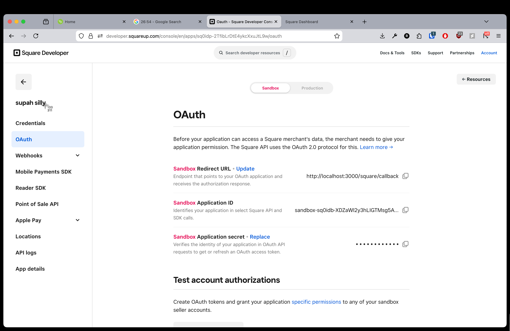
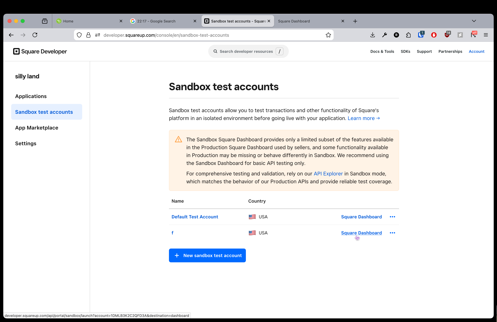
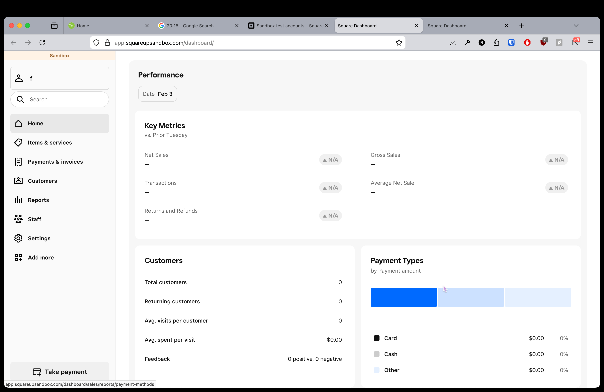

## Square OAuth Setup

Configure the environment variables displayed in the Square Developer dashboard under **OAuth**:

```
REDIRECT_URI=your_redirect_uri
CLIENT_ID=your_client_id
CLIENT_SECRET=your_client_secret
```



## Local Testing Checklist

- Ensure at least one sandbox test account is active.
- Open the corresponding Square Dashboard in a browser tab before kicking off OAuth flows.
- Use the **Sandbox Test Accounts** section in Square Developer to jump directly into each account’s dashboard.



## Dashboard Reference

Keep the dashboard window open while testing so new authorizations apply immediately.


